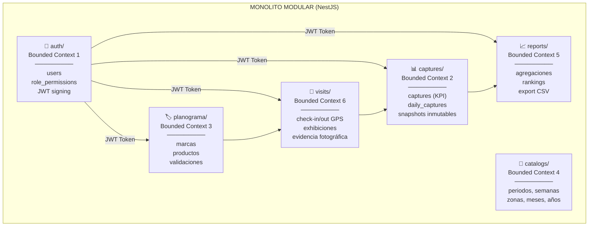
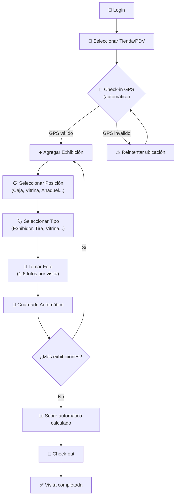

# 📋 Especificaciones Técnicas — Trade Marketing en Campo

> **Versión:** 1.0.0 · **Fecha:** 2026-03-30 · **Estado:** En Desarrollo Activo

---

## 🎯 1. Misión del Proyecto

> *"Digitalizar, centralizar y optimizar el ciclo completo de operaciones de Trade Marketing en campo — desde la captura diaria del ejecutivo hasta el reporte ejecutivo — eliminando el uso de localStorage / hojas de cálculo y habilitando una plataforma multi-usuario, trazable y escalable que en el futuro pueda funcionar como un ecosistema de microservicios independientes."*

### Visión Estratégica

| Horizonte | Meta | Indicador de Éxito |
|---|---|---|
| **Corto** (0-3 meses) | MVP Backend + Frontend web funcional | Login real + capturas persistidas en PostgreSQL |
| **Mediano** (3-9 meses) | App móvil campo + multi-tenant | Captura offline-first con sync, ≥ 2 empresas operando |
| **Largo** (9-18 meses) | Microservicios + BI avanzado | Auth extraído como SSO independiente, analytics en Metabase |

### Objetivo del PRD (Product Requirements Document)

Desarrollar una **app móvil y sistema web** para capturar, validar y cuantificar la ejecución de trade marketing en campo, generando métricas de valor para la toma de decisiones.

### Usuarios del Sistema

| Actor | Descripción | Acceso Principal |
|---|---|---|
| 👤 **Ejecutivo de campo / Auxiliar** | Captura visitas, fotos y evidencias en PDVs | App móvil (campo) |
| 👁️ **Supervisor** | Monitorea, valida y evalúa competencias | Web + App |
| 👑 **Dirección / Marketing** | Analiza KPIs, reportes ejecutivos y ROI | Web dashboard |

---

## 🏛️ 2. Arquitectura del Sistema

### 2.1 Principio Rector: Bounded Contexts + JWT como Puente



### 2.2 Reglas Arquitectónicas INMUTABLES

> [!IMPORTANT]
> Las siguientes reglas son **no negociables** y protegen la futura extracción a microservicios:

1. **Ningún módulo hace JOIN a tablas de otro Bounded Context.**
   - `captures` NO hace `JOIN users ON user_id`. Utiliza `captured_by_username` del JWT.
2. **El JWT es el único puente entre contextos.**
   - Payload: `{ sub: UUID, username: string, zona: string, rol: string }`
3. **Snapshots inmutables.** La columna `captured_by_username` es historial permanente.
4. **Los módulos exponen interfaces, no implementaciones.** Cada módulo tiene su propio `*.module.ts`.

### 2.3 Stack Tecnológico

| Capa | Tecnología | Versión | Justificación |
|---|---|---|---|
| Runtime | Node.js | ≥ 20 LTS | LTS, soporte async nativo |
| Framework | NestJS | ^11.0 | IoC, modularidad enterprise |
| Query Builder | Knex.js | ^3.2 | SQL explícito, migraciones tipadas |
| Base de Datos | PostgreSQL | ≥ 15 | JSONB nativo, UUIDs, ACID |
| Autenticación | JWT + bcryptjs | - | Stateless, portable a SSO |
| Lenguaje | TypeScript | ^5.7 | Seguridad de tipos |
| Testing | Jest + Supertest | ^30 / ^7 | Estándar NestJS |
| Linting | ESLint + Prettier | ^9 / ^3 | Consistencia de código |
| Frontend (futuro) | Angular 18+ / CLI | - | SPA robusta y tipada |
| Móvil (futuro) | Ionic + Angular + Capacitor | - | Solución híbrida PWA/Nativa |

### 2.4 Estado Actual del Código

```
trade_marketing_backend/
├── src/
│   ├── app.module.ts           ✅ Importa AuthModule
│   ├── main.ts                 ✅ Bootstrap NestJS
│   ├── modules/
│   │   └── auth/               ✅ Esqueleto (controller + service vacíos)
│   │       ├── auth.module.ts  ✅ JwtModule registrado (global, 8h, secret)
│   │       ├── auth.controller.ts  ⚠️ Vacío (solo @Controller('auth'))
│   │       └── auth.service.ts     ⚠️ Vacío (solo @Injectable)
│   └── shared/
│       ├── database/
│       │   ├── migrations/
│       │   │   ├── ..._init_auth_schema.ts       ✅ users + role_permissions
│       │   │   └── ..._init_captures_schema.ts   ✅ captures (folio, JSONB)
│       │   └── seeds/                            📋 Vacío
│       ├── decorators/
│       │   └── req-user.decorator.ts             ✅ @ReqUser() extrae request.user
│       └── guards/
│           └── require-auth.guard.ts             ✅ Verifica Bearer JWT
├── knexfile.ts                 ✅ Dev + Prod configurado
├── .env                        ✅ DB_HOST, DB_PORT, etc.
└── docs/
    ├── ARCHITECTURE.md         ✅ Filosofía Bounded Contexts
    └── README.md               ✅ Índice de documentación
```

---

## 📐 3. Modelo de Scoring (Reglas de Negocio)

### 3.1 Fórmula de Score por Exhibición

```
Score = peso_posición × factor_tipo_exhibición × nivel_ejecución
```

> Sin evidencia fotográfica → **Score = 0** (regla absoluta)

### 3.2 Pesos por Posición en Tienda

| Posición | Peso | Justificación |
|---|---|---|
| 🔴 **Caja** (punto de impulso) | 100 | Máxima visibilidad y conversión |
| 🟠 **Adyacente** a caja | 70 | Alta exposición al flujo de pago |
| 🟡 **Vitrina** principal | 60 | Visibilidad prominente al entrar |
| 🟢 **Exhibidor** independiente | 50 | Captación activa del shopper |
| 🔵 **Refrigerador** | 40 | Ubicación funcional de producto |
| ⚪ **Anaquel** estándar | 25 | Ubicación orgánica de la categoría |
| ⚫ **Detrás** del mostrador | 10 | Baja visibilidad, requiere solicitud |

### 3.3 Factor por Tipo de Exhibición

| Tipo de Exhibición | Factor | Nota |
|---|---|---|
| Exhibidor de piso | **2.0** | Máximo impacto visual |
| Refrigerador branded | **1.8** | Alto impacto + funcional |
| Vitrina / aparador | **1.5** | Impacto visual medio-alto |
| Tira (strip) | **1.0** | Impacto base |

### 3.4 Nivel de Ejecución

| Nivel | Multiplicador | Criterio |
|---|---|---|
| **Alto** | 1.0 | Planograma perfecto, limpio, completo |
| **Medio** | 0.7 | Planograma parcial o con faltantes |
| **Bajo** | 0.4 | Desordenado, vacío o dañado |

### 3.5 Ejemplo de Cálculo

```
Exhibidor de piso en caja con ejecución alta:
  Score = 100 × 2.0 × 1.0 = 200 pts

Tira en anaquel con ejecución media:
  Score = 25 × 1.0 × 0.7 = 17.5 pts

Vitrina en refrigerador sin foto:
  Score = 0 (sin evidencia)
```

> [!TIP]
> Los pesos y factores son **configurables** desde el panel de administración. Las fórmulas se almacenan en la tabla `scoring_config` como JSONB.

---

## 📱 4. Flujo UX de Captura en Campo

### 4.1 Principios de Diseño

| Principio | Métrica | Criterio |
|---|---|---|
| ⚡ **Velocidad** | Tiempo por visita completa | **≤ 2 minutos** |
| 🎯 **Eficiencia** | Tiempo por exhibición individual | **≤ 30 segundos** |
| 🖐️ **Simplicidad** | Taps/inputs por exhibición | Mínima escritura |
| 📶 **Resiliencia** | Soporte sin conexión | Offline básico en MVP |

### 4.2 Flujo de Captura (Paso a Paso)



### 4.3 Criterios de Aceptación (del PRD)

| # | Criterio | Validación |
|---|---|---|
| CA-01 | Visita válida requiere GPS **y** evidencia fotográfica | Backend valida ambos campos |
| CA-02 | Cada exhibición con tipo, posición y foto | DTO requiere los 3 campos |
| CA-03 | Score automático calculado por visita | Endpoint retorna score en response |
| CA-04 | Captura por exhibición ≤ 30 segundos | Medido por frontend/UX |
| CA-05 | UX móvil simple, baja fricción | Botones grandes, mínima escritura |

### 4.4 Restricciones del MVP

- ❌ Sin IA para reconocimiento de imagen (futura Fase 5+)
- ❌ Sin validación avanzada de planograma por visión artificial
- ✅ Soporte offline básico (queue local + sync al reconectar)
- ✅ UX móvil con botones grandes y mínima escritura

---

## 🗄️ 5. Esquema de Base de Datos

### 5.1 Bounded Context 1 — Auth *(Existente)*

```sql
-- Permisos por rol
CREATE TABLE role_permissions (
  id           UUID PRIMARY KEY DEFAULT gen_random_uuid(),
  role_name    VARCHAR(50) NOT NULL UNIQUE,
  permissions  JSONB NOT NULL DEFAULT '{}'
);

-- Usuarios del sistema
CREATE TABLE users (
  id            UUID PRIMARY KEY DEFAULT gen_random_uuid(),
  username      VARCHAR(100) NOT NULL UNIQUE,
  password_hash VARCHAR(255) NOT NULL,
  nombre        VARCHAR(150),
  zona          VARCHAR(100),
  role_name     VARCHAR(50) REFERENCES role_permissions(role_name),
  activo        BOOLEAN DEFAULT TRUE,
  created_at    TIMESTAMP DEFAULT NOW()
);
```

### 5.2 Bounded Context 2 — Captures *(Existente + Extensión)*

```sql
-- Capturas de KPIs periódicas (snapshots)  ← YA EXISTE
CREATE TABLE captures (
  id                   UUID PRIMARY KEY DEFAULT gen_random_uuid(),
  folio                VARCHAR(50) NOT NULL UNIQUE,
  user_id              UUID NOT NULL,
  captured_by_username VARCHAR(100) NOT NULL,  -- ⚠️ INMUTABLE
  zona_captura         VARCHAR(100) NOT NULL,
  kpis_data            JSONB NOT NULL,
  fecha_captura        TIMESTAMP DEFAULT NOW()
);

-- Capturas diarias de campo  ← NUEVA MIGRACIÓN
CREATE TABLE daily_captures (
  id                   UUID PRIMARY KEY DEFAULT gen_random_uuid(),
  user_id              UUID NOT NULL,
  captured_by_username VARCHAR(100) NOT NULL,
  zona_captura         VARCHAR(100) NOT NULL,
  fecha                DATE NOT NULL,
  num_visitas          INTEGER NOT NULL DEFAULT 0,
  visitas_data         JSONB NOT NULL,
  stats                JSONB NOT NULL,
  created_at           TIMESTAMP DEFAULT NOW()
);
```

### 5.3 Bounded Context 6 — Visits (Check-in / Exhibiciones) *(Nuevo)*

```sql
-- Tiendas / Puntos de Venta
CREATE TABLE stores (
  id            UUID PRIMARY KEY DEFAULT gen_random_uuid(),
  nombre        VARCHAR(200) NOT NULL,
  direccion     TEXT,
  zona          VARCHAR(100),
  latitud       DECIMAL(10, 7),
  longitud      DECIMAL(10, 7),
  activo        BOOLEAN DEFAULT TRUE,
  created_at    TIMESTAMP DEFAULT NOW()
);

-- Visitas a PDV (check-in / check-out)
CREATE TABLE visits (
  id                   UUID PRIMARY KEY DEFAULT gen_random_uuid(),
  store_id             UUID REFERENCES stores(id),
  user_id              UUID NOT NULL,
  captured_by_username VARCHAR(100) NOT NULL,
  checkin_at           TIMESTAMP NOT NULL,
  checkout_at          TIMESTAMP,
  checkin_lat          DECIMAL(10, 7),
  checkin_lng          DECIMAL(10, 7),
  total_score          DECIMAL(10, 2) DEFAULT 0,
  status               VARCHAR(20) DEFAULT 'in_progress',  -- in_progress | completed
  created_at           TIMESTAMP DEFAULT NOW()
);

-- Exhibiciones registradas por visita
CREATE TABLE exhibitions (
  id            UUID PRIMARY KEY DEFAULT gen_random_uuid(),
  visit_id      UUID REFERENCES visits(id) ON DELETE CASCADE,
  posicion      VARCHAR(50) NOT NULL,   -- caja | adyacente | vitrina | exhibidor | refrigerador | anaquel | detras
  tipo          VARCHAR(50) NOT NULL,   -- exhibidor | refrigerador | vitrina | tira
  nivel_ejecucion VARCHAR(20) NOT NULL, -- alto | medio | bajo
  score         DECIMAL(10, 2) NOT NULL DEFAULT 0,
  notas         TEXT,
  created_at    TIMESTAMP DEFAULT NOW()
);

-- Evidencias fotográficas (1-6 por visita)
CREATE TABLE exhibition_photos (
  id             UUID PRIMARY KEY DEFAULT gen_random_uuid(),
  exhibition_id  UUID REFERENCES exhibitions(id) ON DELETE CASCADE,
  photo_url      TEXT NOT NULL,
  orden          INTEGER DEFAULT 0,
  created_at     TIMESTAMP DEFAULT NOW()
);
```

### 5.4 Bounded Context 3 — Planograma *(Nuevo)*

```sql
CREATE TABLE planograma_marcas (
  id      UUID PRIMARY KEY DEFAULT gen_random_uuid(),
  nombre  VARCHAR(100) NOT NULL UNIQUE,
  activo  BOOLEAN DEFAULT TRUE,
  orden   INTEGER DEFAULT 0
);

CREATE TABLE planograma_productos (
  id        UUID PRIMARY KEY DEFAULT gen_random_uuid(),
  marca_id  UUID REFERENCES planograma_marcas(id) ON DELETE CASCADE,
  nombre    VARCHAR(150) NOT NULL,
  activo    BOOLEAN DEFAULT TRUE,
  orden     INTEGER DEFAULT 0
);
```

### 5.5 Bounded Context 4 — Catálogos *(Nuevo)*

```sql
CREATE TABLE catalogs (
  id          UUID PRIMARY KEY DEFAULT gen_random_uuid(),
  catalog_id  VARCHAR(50) NOT NULL,
  value       VARCHAR(200) NOT NULL,
  orden       INTEGER DEFAULT 0,
  UNIQUE(catalog_id, value)
);
```

### 5.6 Scoring Config *(Nuevo)*

```sql
CREATE TABLE scoring_config (
  id      UUID PRIMARY KEY DEFAULT gen_random_uuid(),
  config  JSONB NOT NULL DEFAULT '{
    "pesos_posicion": {"caja": 100, "adyacente": 70, "vitrina": 60, "exhibidor": 50, "refrigerador": 40, "anaquel": 25, "detras": 10},
    "factores_tipo": {"exhibidor": 2.0, "refrigerador": 1.8, "vitrina": 1.5, "tira": 1.0},
    "niveles_ejecucion": {"alto": 1.0, "medio": 0.7, "bajo": 0.4}
  }',
  updated_at  TIMESTAMP DEFAULT NOW()
);
```

### 5.7 Índices Críticos

```sql
CREATE INDEX idx_captures_user      ON captures(user_id);
CREATE INDEX idx_captures_fecha     ON captures(fecha_captura);
CREATE INDEX idx_captures_zona      ON captures(zona_captura);
CREATE INDEX idx_daily_user_fecha   ON daily_captures(user_id, fecha);
CREATE INDEX idx_visits_store       ON visits(store_id);
CREATE INDEX idx_visits_user_date   ON visits(user_id, checkin_at);
CREATE INDEX idx_exhibitions_visit  ON exhibitions(visit_id);
CREATE INDEX idx_captures_kpis_gin  ON captures USING GIN(kpis_data);
```

---

## 🔑 6. KPIs del Dashboard

### 6.1 Matriz de KPIs Operativos

| ID | KPI | Unidad | Semanal | Quincenal | Mensual | Trimestral | Anual |
|---|---|---|---|---|---|---|---|
| `pdv_visitados` | PDVs Visitados | # | 60 | 120 | 240 | 720 | 2,880 |
| `exhibidores` | Exhibidores Instalados | # | 8 | 16 | 30 | 90 | 360 |
| `vitrinas` | Vitrinas Instaladas | # | 5 | 10 | 20 | 60 | 240 |
| `vitroleros` | Vitroleros Instalados | # | 6 | 12 | 24 | 72 | 288 |
| `paleteros` | Paleteros Instalados | # | 4 | 8 | 16 | 48 | 192 |
| `tiras` | Tiras Instaladas | # | 15 | 30 | 60 | 180 | 720 |
| `planograma` | Cumplimiento Planograma | % | 90% | 90% | 92% | 93% | 95% |
| `permanencia` | Material POP Temporal | % | 85% | 85% | 88% | 90% | 90% |
| `ventas_foco` | Ventas SKUs Foco | $ | $15K | $30K | $60K | $180K | $720K |
| `rotacion` | Rotación por Exhibidor | x | 2.5x | 5x | 10x | 30x | 120x |
| `roi` | ROI por Exhibidor | % | 15% | 15% | 18% | 20% | 22% |
| `incidencias` | Incidencias Resueltas | % | 90% | 90% | 92% | 93% | 95% |
| `evidencias` | Evidencias en Tiempo | % | 95% | 95% | 95% | 95% | 95% |

### 6.2 Competencias del Ejecutivo (Score 0–5)

| ID | Competencia | Peso |
|---|---|---|
| `negociacion` | Negociación en PDV | 25% |
| `resultados` | Orientación a Resultados | 20% |
| `disciplina` | Disciplina Operativa | 15% |
| `observacion` | Observación Comercial | 15% |
| `influencia` | Influencia y Persuasión | 15% |
| `resiliencia` | Resiliencia | 10% |

**Score Ponderado** = Σ (score_competencia × peso / 100) → máximo 5.0

### 6.3 Compensación Variable (Períodos Mensual+)

| Componente | Indicador | Peso |
|---|---|---|
| Cobertura PDV | % PDV visitados | 30% |
| Planograma | % cumplimiento | 25% |
| Ventas SKU Foco | Incremento % | 25% |
| Permanencia | % material activo | 10% |
| Ejecución | Índice compuesto | 10% |

---

## 🔐 7. Autenticación y Permisos

### 7.1 JWT Payload (Estándar SSO)

```typescript
interface JwtPayload {
  sub:      string;   // user_id (UUID)
  username: string;   // snapshot inmutable
  zona:     string;   // zona asignada
  rol:      string;   // 'superadmin' | 'ejecutivo' | 'reportes'
  iat:      number;
  exp:      number;   // expira en 8h
}
```

### 7.2 Matriz de Permisos

| Permiso | 👑 Super Admin | 📋 Ejecutivo | 📊 Reportes |
|---|:---:|:---:|:---:|
| Capturar KPIs / Exhibiciones | ✅ | ✅ | ❌ |
| Configurar Metas | ✅ | ❌ | ❌ |
| Evaluar Competencias | ✅ | ❌ | ❌ |
| Compensación Variable | ✅ | ❌ | ❌ |
| Editar Info General | ✅ | ✅ | ❌ |
| Exportar Datos | ✅ | ❌ | ✅ |
| Importar Datos | ✅ | ❌ | ❌ |
| Reset de Periodos | ✅ | ❌ | ❌ |
| Ver Todos los Datos | ✅ | ❌ | ✅ |
| Check-in/out en campo | ✅ | ✅ | ❌ |
| Validar visitas | ✅ | ❌ | ❌ |
| Admin (usuarios, catálogos) | ✅ | ❌ | ❌ |

---

## 🌐 8. API RESTful — Endpoints Planificados

### Auth (`/api/auth`)

| Método | Endpoint | Descripción | Roles |
|---|---|---|---|
| `POST` | `/auth/login` | Login → JWT | Público |
| `POST` | `/auth/logout` | Invalidar sesión | Autenticado |
| `GET` | `/auth/profile` | Info usuario actual | Autenticado |
| `PUT` | `/auth/change-password` | Cambiar contraseña | Autenticado |

### Users (`/api/users`)

| Método | Endpoint | Descripción | Roles |
|---|---|---|---|
| `GET` | `/users` | Listar usuarios | superadmin |
| `POST` | `/users` | Crear usuario | superadmin |
| `GET` | `/users/:id` | Obtener usuario | superadmin |
| `PUT` | `/users/:id` | Actualizar usuario | superadmin |
| `DELETE` | `/users/:id` | Soft delete | superadmin |

### Captures (`/api/captures`)

| Método | Endpoint | Descripción | Roles |
|---|---|---|---|
| `GET` | `/captures` | Listar (filtro: zona, periodo, fecha) | superadmin, reportes |
| `POST` | `/captures` | Guardar snapshot KPI | ejecutivo, superadmin |
| `GET` | `/captures/:id` | Obtener por ID/folio | superadmin, reportes |
| `DELETE` | `/captures/:id` | Eliminar captura | superadmin |

### Daily Captures (`/api/daily-captures`)

| Método | Endpoint | Descripción | Roles |
|---|---|---|---|
| `GET` | `/daily-captures` | Listar (filtro: fecha, zona) | superadmin, reportes |
| `POST` | `/daily-captures` | Guardar captura diaria | ejecutivo, superadmin |
| `GET` | `/daily-captures/:id` | Obtener detalle | Autenticado |

### Visits (`/api/visits`)

| Método | Endpoint | Descripción | Roles |
|---|---|---|---|
| `POST` | `/visits/checkin` | Check-in GPS a PDV | ejecutivo, superadmin |
| `PUT` | `/visits/:id/checkout` | Check-out de visita | ejecutivo |
| `GET` | `/visits` | Listar visitas | superadmin, reportes |
| `GET` | `/visits/:id` | Detalle de visita + exhibiciones | Autenticado |

### Exhibitions (`/api/exhibitions`)

| Método | Endpoint | Descripción | Roles |
|---|---|---|---|
| `POST` | `/exhibitions` | Registrar exhibición + foto | ejecutivo |
| `GET` | `/exhibitions/:visitId` | Exhibiciones de una visita | Autenticado |
| `POST` | `/exhibitions/:id/photos` | Subir foto evidencia | ejecutivo |

### Stores (`/api/stores`)

| Método | Endpoint | Descripción | Roles |
|---|---|---|---|
| `GET` | `/stores` | Listar PDVs | Autenticado |
| `POST` | `/stores` | Crear PDV | superadmin |
| `PUT` | `/stores/:id` | Editar PDV | superadmin |

### Planograma (`/api/planograma`)

| Método | Endpoint | Descripción | Roles |
|---|---|---|---|
| `GET` | `/planograma/brands` | Marcas y productos | Autenticado |
| `POST` | `/planograma/brands` | Crear marca | superadmin |
| `POST` | `/planograma/brands/:id/products` | Agregar producto | superadmin |
| `DELETE` | `/planograma/brands/:id` | Eliminar marca | superadmin |

### Catálogos (`/api/catalogs`)

| Método | Endpoint | Descripción | Roles |
|---|---|---|---|
| `GET` | `/catalogs/:type` | Obtener catálogo | Autenticado |
| `POST` | `/catalogs/:type` | Agregar ítem | superadmin |
| `DELETE` | `/catalogs/:type/:id` | Eliminar ítem | superadmin |

### Scoring (`/api/scoring`)

| Método | Endpoint | Descripción | Roles |
|---|---|---|---|
| `GET` | `/scoring/config` | Obtener config de pesos | superadmin |
| `PUT` | `/scoring/config` | Actualizar pesos/factores | superadmin |
| `GET` | `/scoring/calculate` | Calcular score para exhibición | interno |

### Reports (`/api/reports`)

| Método | Endpoint | Descripción | Roles |
|---|---|---|---|
| `GET` | `/reports/summary` | Resumen ejecutivo | superadmin, reportes |
| `GET` | `/reports/by-zone` | Comparativa por zona | superadmin, reportes |
| `GET` | `/reports/by-executive` | Ranking ejecutivos | superadmin, reportes |
| `GET` | `/reports/export/csv` | Exportar CSV | superadmin, reportes |

---

## 🗺️ 9. Roadmap por Fases

---

### Fase 0 — Fundamentos ✅ *(Completada)*

> **Objetivo:** Establecer la base del proyecto y la filosofía arquitectónica.

**Entregables completados:**
- [x] Proyecto NestJS con TypeScript inicializado
- [x] Knex.js + PostgreSQL configurados (`knexfile.ts`, `.env`)
- [x] Filosofía de Bounded Contexts documentada (`ARCHITECTURE.md`)
- [x] Migraciones iniciales: `users`, `role_permissions`, `captures`
- [x] `RequireAuthGuard` operativo (JWT verification)
- [x] `@ReqUser()` decorator para extraer payload del request
- [x] `AuthModule` con `JwtModule.register()` global

---

### Fase 1 — Backend Core 🔧 *(En Progreso)*

> **Objetivo:** API completamente funcional para autenticación, usuarios y capturas.
> **Duración:** 3–4 semanas

#### Entregables por Equipo

##### 🏗️ Arquitecto de Sistema
| # | Entregable | Descripción | Criterio de Aceptación |
|---|---|---|---|
| A1.1 | ADR: Estrategia de Refresh Token | Documentar decisión de refresh vs re-login | ADR aprobado por equipo |
| A1.2 | Diagrama de secuencia: flujo de login | Mermaid diagram con todos los pasos | Cubre happy path + errores |
| A1.3 | Review de DTOs y contratos API | Validar que contratos respetan bounded contexts | No hay imports cross-module |

##### 📊 Analista Funcional
| # | Entregable | Descripción | Criterio de Aceptación |
|---|---|---|---|
| AF1.1 | User Stories: Autenticación | Login, logout, cambio de contraseña | Formato Given/When/Then |
| AF1.2 | User Stories: Captura KPI | Guardar snapshot periódico, filtros | ≥ 5 historias con criterios de aceptación |
| AF1.3 | Glosario de negocio v1 | Términos: PDV, folio, zona, ruta, etc. | Aprobado por stakeholder |
| AF1.4 | Priorización de backlog Phase 1 | Moscow ordering de features | Acordado con dev team |

##### ⚙️ Dev Backend
| # | Entregable | Descripción | Criterio de Aceptación |
|---|---|---|---|
| BE1.1 | `POST /auth/login` | Login con bcrypt + JWT signing | Test e2e pasando; retorna JWT válido |
| BE1.2 | `GET /auth/profile` | Retorna data del usuario autenticado | Requiere Bearer token; retorna payload |
| BE1.3 | `RolesGuard` | Guard que verifica `rol` del JWT vs roles permitidos | Test unitario con roles ≠ |
| BE1.4 | CRUD `/users` | Crear, listar, editar, soft-delete usuarios | Solo accesible por superadmin |
| BE1.5 | `POST /captures` | Guardar captura KPI con folio automático | Folio único; JSONB completo; snapshot username |
| BE1.6 | `GET /captures` | Listar con filtros (zona, fecha, ejecutivo) | Query params funcionales; paginación |
| BE1.7 | `POST /daily-captures` | Guardar captura diaria completa | Validación de esquema JSONB |
| BE1.8 | Swagger UI | Documentación auto-generada en `/api/docs` | Todos los endpoints documentados |

##### 🗄️ Dev Base de Datos
| # | Entregable | Descripción | Criterio de Aceptación |
|---|---|---|---|
| DB1.1 | Migración: `daily_captures` | Tabla con JSONB para visitas y stats | `up()` y `down()` probados |
| DB1.2 | Seed: `role_permissions` | 3 roles con permisos completos | Seed idempotente |
| DB1.3 | Seed: `users` | 3 usuarios default (admin, ejecutivo, reportes) | Passwords hasheados con bcrypt |
| DB1.4 | Índices de performance | `idx_captures_*`, `idx_daily_*` | `EXPLAIN ANALYZE` < 50ms en 1K rows |
| DB1.5 | `knex.provider.ts` | Provider de Knex inyectable en NestJS | Usado por todos los services |

##### 🧪 QA
| # | Entregable | Descripción | Criterio de Aceptación |
|---|---|---|---|
| QA1.1 | Plan de pruebas Phase 1 | Casos de prueba para auth + captures | ≥ 20 test cases documentados |
| QA1.2 | Tests: Auth | Login ok, login fail, token expirado, usuario inactivo | 100% cobertura happy + sad paths |
| QA1.3 | Tests: RBAC | Ejecutivo no accede a admin routes, etc. | Todos los roles probados |
| QA1.4 | Tests: Captures | Crear, listar, filtrar, folio único | ≥ 10 test cases |
| QA1.5 | Reporte de cobertura | `npm run test:cov` | ≥ 70% statements |

##### 📖 Documentación
| # | Entregable | Descripción | Criterio de Aceptación |
|---|---|---|---|
| DOC1.1 | Swagger completado | Decoradores `@ApiProperty`, `@ApiResponse` | Todos los DTOs documentados |
| DOC1.2 | README actualizado | Setup, env vars, migraciones, seeds | Un dev nuevo arranca en < 15 min |
| DOC1.3 | DATABASE_SCHEMA.md | Esquema ERD + DDL | Todas las tablas Phase 1 |

**KPIs de Fase 1:**
- 🎯 100% endpoints Phase 1 pasando tests e2e
- 🎯 Tiempo de respuesta `POST /captures` < 200ms (p95)
- 🎯 Cobertura de tests ≥ 70%
- 🎯 0 imports cross-module

---

### Fase 2 — Módulos de Negocio 📋 *(Planificada)*

> **Objetivo:** Completar Planograma, Catálogos, y Módulo de Scoring.
> **Duración:** 2–3 semanas

#### Entregables por Equipo

##### 🏗️ Arquitecto de Sistema
| # | Entregable | Criterio |
|---|---|---|
| A2.1 | ADR: Almacenamiento de fotos (S3 vs filesystem) | Decisión documentada con pros/cons |
| A2.2 | Contrato: Scoring Service interface | Interfaz desacoplada del módulo de visits |
| A2.3 | Review de integridad referencial cross-BC | No hay FKs entre bounded contexts |

##### 📊 Analista Funcional
| # | Entregable | Criterio |
|---|---|---|
| AF2.1 | User Stories: Planograma completo | CRUD marcas + productos + validación |
| AF2.2 | User Stories: Catálogos dinámicos | Auto-sync ejecutivos y zonas |
| AF2.3 | Reglas de negocio: Scoring documentadas | Fórmula + tabla de pesos aprobada |
| AF2.4 | Wireframes de flujo de scoring (revisión) | Confirmación con stakeholder |

##### ⚙️ Dev Backend
| # | Entregable | Criterio |
|---|---|---|
| BE2.1 | CRUD `/planograma/brands` + products | Seed con 13 marcas, ~100 productos |
| BE2.2 | CRUD `/catalogs/:type` | 6 tipos de catálogos operativos |
| BE2.3 | `POST /scoring/config` + `GET` | Config JSONB editable |
| BE2.4 | Scoring engine service | Input: posición + tipo + nivel → score |
| BE2.5 | `/reports/summary` | Agregación por periodo |
| BE2.6 | `/reports/export/csv` | Descarga de CSV |
| BE2.7 | Permisos dinámicos desde `role_permissions` | JSONB consultado en runtime |

##### 🗄️ Dev Base de Datos
| # | Entregable | Criterio |
|---|---|---|
| DB2.1 | Migración: `planograma_marcas` + `planograma_productos` | Cascada en delete |
| DB2.2 | Migración: `catalogs` | Unique constraint (catalog_id, value) |
| DB2.3 | Migración: `scoring_config` | JSONB con defaults |
| DB2.4 | Seed: Planograma default | 13 marcas, ≥100 productos |
| DB2.5 | Seed: Catálogos default | 52 semanas, 24 quincenas, 12 meses |

##### 🧪 QA
| # | Entregable | Criterio |
|---|---|---|
| QA2.1 | Tests: Planograma CRUD | Create, read, update, delete |
| QA2.2 | Tests: Scoring engine | Fórmula correcta; sin evidencia = 0 |
| QA2.3 | Tests: Reports | Agregaciones correctas |
| QA2.4 | Test de regresión Phase 1 | Todo lo anterior sigue verde |

##### 📖 Documentación
| # | Entregable | Criterio |
|---|---|---|
| DOC2.1 | API_REFERENCE.md actualizado | Nuevos endpoints documentados |
| DOC2.2 | Scoring Rule Book | Tablas de pesos con ejemplos |
| DOC2.3 | Changelog v0.2 | Listado de cambios |

**KPIs de Fase 2:**
- 🎯 Planograma con 13 marcas + ≥100 productos operativo via API
- 🎯 Scoring engine con 100% de test coverage en fórmula
- 🎯 Reportes generados en < 500ms para 1,000 capturas

---

### Fase 3 — Frontend Web 📋 *(Planificada)*

> **Objetivo:** Migrar la SPA de localStorage a una app conectada a la API.
> **Duración:** 4–6 semanas

#### Entregables por Equipo

##### 🎨 Dev UI/UX
| # | Entregable | Criterio |
|---|---|---|
| UI3.1 | Design System tokens (colores, tipografía, spacing) | Basado en el dashboard actual (DM Sans, IBM Plex Mono) |
| UI3.2 | Componente library: Cards, Buttons, Tables, Badges | ≥ 15 componentes |
| UI3.3 | Prototipos interactivos (Figma/código) | Login, Dashboard, Captura, Admin |
| UI3.4 | Dark mode definido (palette actual) | Variables CSS coherentes |
| UI3.5 | Responsive breakpoints | Mobile-first con 3 breakpoints |

##### 🖥️ Dev Frontend
| # | Entregable | Criterio |
|---|---|---|
| FE3.1 | Proyecto Angular CLI + Angular 18 | Build exitoso en < 5 seg |
| FE3.2 | Página: Login con JWT | Token almacenado en httpOnly cookie o memoria |
| FE3.3 | Página: Dashboard KPIs | 5 periodos, score cards, tablas, gráficas |
| FE3.4 | Página: Captura Diaria (planograma + material) | Tabla dinámica por visita |
| FE3.5 | Página: Reportes con filtros | Zona, ejecutivo, periodo, export |
| FE3.6 | Página: Admin (Usuarios, Catálogos, Planograma, Permisos) | Solo visible para superadmin |
| FE3.7 | State management (NgRx / Signals + RxJS) | Caching de datos del servidor |
| FE3.8 | Interceptor de auth | Refresh token / redirect a login |
| FE3.9 | 0 accesos a `localStorage` para datos de negocio | Solo para theme/preferencias locales |

##### 🧪 QA
| # | Entregable | Criterio |
|---|---|---|
| QA3.1 | E2E tests con Playwright | Login → Dashboard → Captura → Reportes |
| QA3.2 | Test de accesibilidad (a11y) | Score ≥ 85 en axe-core |
| QA3.3 | Test de performance | Lighthouse ≥ 85 |

**KPIs de Fase 3:**
- 🎯 Lighthouse Performance ≥ 85
- 🎯 First Contentful Paint < 1.5s
- 🎯 Zero `localStorage` para datos de negocio

---

### Fase 4 — App Móvil de Campo 📋 *(Planificada)*

> **Objetivo:** App Ionic + Angular para ejecutivos con soporte offline.
> **Duración:** 6–8 semanas

#### Entregables por Equipo

##### 🎨 Dev UI/UX
| # | Entregable | Criterio |
|---|---|---|
| UI4.1 | Wireframes móviles para flujo de campo | Botones grandes, mínima escritura |
| UI4.2 | Prototipo del flujo check-in → exhibición → foto | ≤ 3 taps por exhibición |
| UI4.3 | Indicadores de estado offline/sync | Claro y no intrusivo |

##### 🖥️ Dev Frontend (Mobile)
| # | Entregable | Criterio |
|---|---|---|
| MOB4.1 | Proyecto Ionic + Angular + Capacitor | Build iOS + Android |
| MOB4.2 | Login + almacenamiento seguro de JWT | Secure storage nativo |
| MOB4.3 | Check-in con geolocalización | GPS real validado |
| MOB4.4 | Registro de exhibición: posición + tipo + foto | ≤ 30 seg por exhibición |
| MOB4.5 | Captura de 1-6 fotos por visita | Compresión + upload |
| MOB4.6 | Cola offline + auto-sync | Persistencia local + sync al reconectar |
| MOB4.7 | Push notifications | Alertas KPI debajo del umbral |
| MOB4.8 | Check-out con score calculado | Score mostrado antes de confirmar |

##### ⚙️ Dev Backend
| # | Entregable | Criterio |
|---|---|---|
| BE4.1 | Endpoint de upload de fotos | Multipart/form-data → S3/storage |
| BE4.2 | Endpoint `/visits/checkin` con validación GPS | Lat + Lng requeridos |
| BE4.3 | Endpoint `/visits/:id/checkout` con cálculo de score | Score automático |
| BE4.4 | API de sync batch (para offline queue) | POST array de capturas |

##### 🧪 QA
| # | Entregable | Criterio |
|---|---|---|
| QA4.1 | Tests de captura en condiciones de campo | Conexión inestable, GPS lento |
| QA4.2 | Tests de sync offline | Crear sin conexión → sync exitoso |
| QA4.3 | Tests de geolocalización | Validación de coords reales |

**KPIs de Fase 4:**
- 🎯 Captura diaria funcional sin internet
- 🎯 Sync en < 30 seg al reconectar
- 🎯 Adopción ≥ 80% de ejecutivos activos

---

### Fase 5 — Infraestructura y Observabilidad 📋 *(Planificada)*

> **Objetivo:** Preparar para producción y futuro de microservicios.
> **Duración:** 3–4 semanas

#### Entregables por Equipo

##### 🏗️ Arquitecto de Sistema
| # | Entregable | Criterio |
|---|---|---|
| A5.1 | Diagrama de deployment (Docker + CI/CD) | Mermaid con todos los servicios |
| A5.2 | Plan de extracción de Auth a SSO | Timeline + breaking changes |
| A5.3 | Estrategia de logging y correlation IDs | Winston + request ID |

##### ⚙️ Dev Backend
| # | Entregable | Criterio |
|---|---|---|
| BE5.1 | Docker Compose (app + postgres) | `docker compose up` funcional |
| BE5.2 | Health check endpoint `/health` | DB connectivity + version |
| BE5.3 | Rate limiting (Throttle) | ≤ 100 req/min por IP |
| BE5.4 | Helmet + CORS configurados | Headers de seguridad |
| BE5.5 | Logging estructurado (Winston) | JSON logs + correlation ID |

##### 🗄️ Dev Base de Datos
| # | Entregable | Criterio |
|---|---|---|
| DB5.1 | Script de backup automatizado | pg_dump con rotación |
| DB5.2 | Migración: `audit_log` | Tabla de auditoría |

##### 🧪 QA
| # | Entregable | Criterio |
|---|---|---|
| QA5.1 | Tests de carga (Artillery/k6) | ≥ 100 req/s sin errores |
| QA5.2 | Tests de seguridad (OWASP basics) | Top 10 OWASP cubierto |
| QA5.3 | CI pipeline verde | Build + test + lint en cada PR |

##### 📖 Documentación
| # | Entregable | Criterio |
|---|---|---|
| DOC5.1 | Runbook de operaciones | Procedimientos de deploy, rollback, backup |
| DOC5.2 | Manual de usuario final | Con capturas de pantalla |

**KPIs de Fase 5:**
- 🎯 Uptime ≥ 99.5%
- 🎯 Deploy ≤ 5 minutos
- 🎯 Rate limiting configurado en todos los endpoints

---

### Fase 6 — BI, Analytics y Multi-tenant 📋 *(Futuro)*

> **Objetivo:** Análisis avanzado y soporte multi-empresa.
> **Duración:** 4–6 semanas

| # | Entregable | Equipo |
|---|---|---|
| 6.1 | Integración con Metabase/Grafana | Arquitecto + DBA |
| 6.2 | Campo `org_id` para multi-tenancy | DBA + Backend |
| 6.3 | Webhooks de eventos (`capture.created`, etc.) | Backend |
| 6.4 | API de BI con agregaciones complejas | Backend + DBA |
| 6.5 | Dashboard ejecutivo con BI embebido | Frontend |

---

## 📊 10. KPIs del Proyecto (Métricas de Éxito)

### Técnicos

| Métrica | Fase 1 | Fase 3 | Fase 5 |
|---|---|---|---|
| Cobertura de tests | ≥ 70% | ≥ 80% | ≥ 85% |
| Tiempo respuesta API (p95) | < 300ms | < 200ms | < 150ms |
| Uptime | Dev only | ≥ 99% | ≥ 99.5% |
| Errores producción | N/A | < 1% req | < 0.5% req |
| Build CI | N/A | < 3min | < 2min |

### Negocio

| Métrica | 3 meses | 6 meses | 12 meses |
|---|---|---|---|
| Ejecutivos activos | ≥ 5 | ≥ 15 | ≥ 30 |
| Capturas diarias/ejecutivo/semana | ≥ 3 | ≥ 5 | ≥ 5 |
| Adopción digital vs papel | ≥ 60% | ≥ 85% | ≥ 95% |
| Tiempo de reporte | < 5 min | < 1 min | < 30 seg |
| Datos perdidos por error | 0 | 0 | 0 |

---

## 💡 11. Mejoras Propuestas

### 🔴 Alta Prioridad

1. **Auditoría de cambios** — Tabla `audit_log` para trazabilidad completa. Quién cambió qué y cuándo.
2. **Validación GPS obligatoria** — Registrar coordenadas del PDV para validar visitas reales vs reportadas.
3. **Token Refresh** — JWT actual expira en 8h sin renovación. Implementar refresh token para sesiones largas de campo.
4. **Tabla de tiendas/PDVs** — El dashboard actual no tiene catálogo de tiendas. Necesario para check-in GPS y reportes por PDV.

### 🟡 Media Prioridad

5. **Historial de metas** — Versionar metas de KPI para que reportes históricos usen las metas del periodo, no las actuales.
6. **Notificaciones de alertas KPI** — Webhook, email o push cuando un KPI cae por debajo del umbral.
7. **Multi-tenant** (`org_id`) — Preparar para múltiples empresas sin refactoring mayor.
8. **Fotos con compresión y CDN** — Las evidencias fotográficas necesitan optimización para campo con baja conectividad.

### 🟢 Baja Prioridad

9. **Dashboard de BI embebido** — Metabase o Grafana conectado a PostgreSQL.
10. **Webhooks de eventos** — Para integraciones con CRM/ERP.
11. **Rate limiting por usuario** — Prevenir capturas duplicadas en ventanas cortas.
12. **IA para validación de planograma** — Reconocimiento de imagen para verificar cumplimiento automáticamente (post-MVP).

---

## 📝 12. Glosario del Negocio

| Término | Definición |
|---|---|
| **PDV** | Punto de Venta — establecimiento físico donde se venden productos |
| **Ejecutivo de Campo** | Representante de Trade Marketing que visita PDVs |
| **Planograma** | Disposición estándar de productos en exhibidores/vitrinas |
| **Captura Diaria** | Registro por visita a PDV: material, planograma, venta |
| **Captura KPI** | Snapshot periódico del desempeño del ejecutivo |
| **Folio** | ID único de captura (`TM-YYYYMMDD-XXXX`) |
| **Zona / Ruta** | División geográfica asignada a un ejecutivo |
| **SKU Foco** | Producto priorizado para ventas en el periodo |
| **Material POP** | Material publicitario en el PDV (exhibidores, vitrinas) |
| **Score Integral** | Ponderación final: KPIs + competencias |
| **Comp. Variable** | Compensación adicional por cumplimiento de KPIs |
| **Check-in** | Registro de llegada a un PDV con validación GPS |
| **Exhibición** | Instalación de material en una posición específica del PDV |
| **Score de Exhibición** | peso_posición × factor_tipo × nivel_ejecución |
| **Bounded Context** | Límite lógico de un modelo de dominio (patrón DDD) |

---

## 🤝 13. Convenciones del Equipo

### Código
- **Idioma:** Código en inglés, comentarios y docs en español
- **Tablas:** `snake_case` plural (`daily_captures`)
- **Columnas:** `snake_case` (`captured_by_username`)
- **Endpoints:** `kebab-case` plural (`/daily-captures`)
- **DTOs:** `PascalCase` + `Dto` (`CreateCaptureDto`)
- **Sin JOIN entre Bounded Contexts**

### Git
- **Branches:** `feature/nombre`, `fix/bug`, `docs/tema`
- **Commits:** Conventional Commits (`feat:`, `fix:`, `docs:`, `refactor:`, `test:`)
- **PRs:** Requieren 1 review mínimo

### Migraciones
- **Nombre:** `YYYYMMDDHHMMSS_descripcion.ts`
- **Nunca** editar migración ya ejecutada en producción
- Siempre incluir `down()` para rollback

---

*Documento vivo. Actualizar conforme evoluciona el proyecto. · Última revisión: 2026-03-30*
