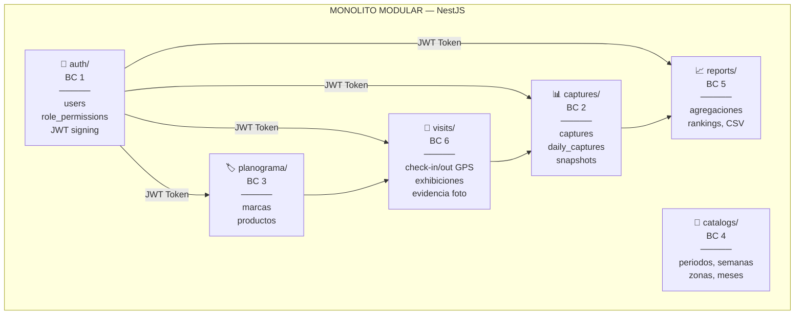

# 🏗️ Arquitecto de Sistema — Trade Marketing en Campo

> **Responsabilidad:** Diseño de Bounded Contexts, patrones de integración, decisiones arquitectónicas y evolución a microservicios.

---

## 1. Principio Rector: Bounded Contexts + JWT como Puente



## 2. Reglas Arquitectónicas INMUTABLES

> ⚠️ **CRÍTICO** — Las siguientes reglas son **no negociables**:

1. **Ningún módulo hace JOIN a tablas de otro Bounded Context.**
   - `captures` NO hace `JOIN users ON user_id`. Utiliza `captured_by_username` del JWT.
2. **El JWT es el único puente entre contextos.**
   - Payload: `{ sub: UUID, username: string, zona: string, rol: string }`
3. **Snapshots inmutables.** `captured_by_username` es historial permanente. **Nunca borrar esa columna.**
4. **Los módulos exponen interfaces, no implementaciones.** Cada módulo tiene su `*.module.ts` encapsulado.
5. **Las FKs cross-context son temporales.** La FK `captures.user_id → users.id` existe hoy pero se elimina al extraer Auth como SSO.

## 3. Stack Tecnológico

| Capa | Tecnología | Versión | Justificación |
|---|---|---|---|
| Runtime | Node.js | ≥ 20 LTS | LTS, async nativo |
| Framework | NestJS | ^11.0 | IoC, modularidad enterprise |
| Query Builder | Knex.js | ^3.2 | SQL explícito, migraciones tipadas |
| Base de Datos | PostgreSQL | ≥ 15 | JSONB, UUIDs, ACID |
| Autenticación | JWT + bcryptjs | — | Stateless, SSO-ready |
| Lenguaje | TypeScript | ^5.7 | Type safety |
| Testing | Jest + Supertest | ^30 / ^7 | Estándar NestJS |
| Frontend (futuro) | React 18+ / Vite | — | SPA moderna |
| Móvil (futuro) | React Native + Expo | — | Comparte equipo frontend |

## 4. Estado Actual del Código

```
trade_marketing_backend/
├── src/
│   ├── app.module.ts           ✅ Importa AuthModule
│   ├── main.ts                 ✅ Bootstrap NestJS
│   ├── modules/
│   │   └── auth/               ✅ Esqueleto
│   │       ├── auth.module.ts  ✅ JwtModule.register (global, 8h)
│   │       ├── auth.controller.ts  ⚠️ Vacío
│   │       └── auth.service.ts     ⚠️ Vacío
│   └── shared/
│       ├── database/migrations/
│       │   ├── ..._init_auth_schema.ts       ✅ users + role_permissions
│       │   └── ..._init_captures_schema.ts   ✅ captures
│       ├── decorators/req-user.decorator.ts  ✅ @ReqUser()
│       └── guards/require-auth.guard.ts      ✅ JWT verification
├── knexfile.ts                 ✅ Dev + Prod
├── .env                        ✅ Configurado
└── docs/ARCHITECTURE.md        ✅ Filosofía documentada
```

## 5. Estructura de Directorios Objetivo

```
src/modules/
├── auth/              # BC 1: Identidad y Autenticación
│   ├── auth.module.ts
│   ├── auth.controller.ts
│   ├── auth.service.ts
│   ├── dto/login.dto.ts
│   └── strategies/jwt.strategy.ts
├── users/             # BC 1 (sub-context): Gestión de Usuarios
│   ├── users.module.ts
│   ├── users.controller.ts
│   └── users.service.ts
├── captures/          # BC 2: Capturas KPI Periódicas
├── daily-captures/    # BC 2: Capturas Diarias de Campo
├── visits/            # BC 6: Check-in/out + Exhibiciones
├── planograma/        # BC 3: Gestión de Planograma
├── catalogs/          # BC 4: Catálogos Configurables
└── reports/           # BC 5: Reportes y Analytics
```

## 6. Entregables por Fase

### Fase 1 — Backend Core 🔧

| # | Entregable | Criterio de Aceptación |
|---|---|---|
| A1.1 | ADR: Estrategia de Refresh Token | Documento con decisión y justificación |
| A1.2 | Diagrama de secuencia: flujo de login | Mermaid con happy path + errores |
| A1.3 | Review de DTOs y contratos API | 0 imports cross-module |

### Fase 2 — Módulos de Negocio 📋

| # | Entregable | Criterio de Aceptación |
|---|---|---|
| A2.1 | ADR: Almacenamiento de fotos (S3 vs filesystem) | Pros/cons documentados |
| A2.2 | Contrato: Scoring Service interface | Interface desacoplada de visits |
| A2.3 | Review de integridad referencial cross-BC | 0 FKs entre bounded contexts |

### Fase 5 — Infraestructura 📋

| # | Entregable | Criterio de Aceptación |
|---|---|---|
| A5.1 | Diagrama de deployment (Docker + CI/CD) | Mermaid completo |
| A5.2 | Plan de extracción de Auth a SSO | Timeline + breaking changes |
| A5.3 | Estrategia de logging y correlation IDs | Winston + request ID |

## 7. Decisiones Arquitectónicas Pendientes (ADR)

| # | Tema | Opciones | Status |
|---|---|---|---|
| ADR-001 | Refresh Token vs Re-login | Refresh token rotation / Re-login cada 8h | 📋 Pendiente |
| ADR-002 | Storage de fotos | S3 / Cloudflare R2 / Filesystem local | 📋 Pendiente |
| ADR-003 | Estrategia de cache | Redis / In-memory NestJS / None (MVP) | 📋 Pendiente |
| ADR-004 | Messaging para eventos | Direct calls / Bull queues / Webhooks | 📋 Pendiente |
| ADR-005 | Multi-tenancy approach | org_id column / separate schemas / separate DBs | 📋 Pendiente |

## 8. Mejoras Arquitectónicas Propuestas

1. **Auditoría** — Tabla `audit_log` con trigger para trazabilidad.
2. **Event-driven** — Publicar eventos (`capture.created`) para desacoplar.
3. **Config service** — Centralizar scoring_config y metas en un servicio inyectable.
4. **Health checks** — `/health` endpoint con DB connectivity check.

---

*Contacto: Coordinar con todos los equipos para reviews de contratos y ADRs.*
