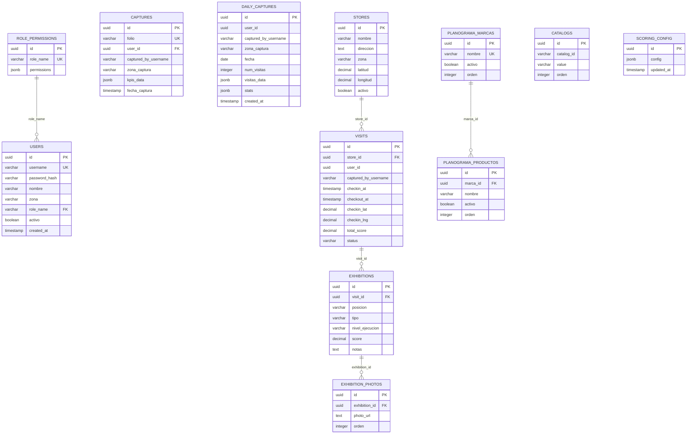

# 🗄️ Dev Base de Datos — Trade Marketing en Campo

> **Responsabilidad:** Esquema PostgreSQL, migraciones Knex.js, seeds, índices, integridad referencial y performance de queries.

---

## 1. Configuración Actual

### Knex.js (`knexfile.ts`)

```typescript
// Development
{
  client: 'postgresql',
  connection: {
    host: process.env.DB_HOST || 'localhost',
    port: Number(process.env.DB_PORT) || 5432,
    database: process.env.DB_NAME || 'trade_marketing',
    user: process.env.DB_USER || 'postgres',
    password: process.env.DB_PASSWORD || 'postgres',
  },
  pool: { min: 2, max: 10 },
  migrations: {
    tableName: 'knex_migrations',
    directory: './src/shared/database/migrations',
    extension: 'ts',
  },
  seeds: {
    directory: './src/shared/database/seeds',
    extension: 'ts',
  },
}
```

### Variables de entorno

```bash
DB_HOST=localhost
DB_PORT=5432
DB_NAME=trade_marketing
DB_USER=postgres
DB_PASSWORD=postgres
```

## 2. Migraciones Existentes

| Archivo | Tablas | Estado |
|---|---|---|
| `20260330165441_init_auth_schema.ts` | `role_permissions`, `users` | ✅ Creada |
| `20260330165442_init_captures_schema.ts` | `captures` | ✅ Creada |

### Detalle de tablas existentes

```sql
-- role_permissions
CREATE TABLE role_permissions (
  id         UUID PRIMARY KEY DEFAULT gen_random_uuid(),
  role_name  VARCHAR(50) NOT NULL UNIQUE,
  permissions JSONB NOT NULL DEFAULT '{}'
);

-- users
CREATE TABLE users (
  id            UUID PRIMARY KEY DEFAULT gen_random_uuid(),
  username      VARCHAR(100) NOT NULL UNIQUE,
  password_hash VARCHAR(255) NOT NULL,
  nombre        VARCHAR(150),
  zona          VARCHAR(100),
  role_name     VARCHAR(50) REFERENCES role_permissions(role_name),
  activo        BOOLEAN DEFAULT TRUE,
  created_at    TIMESTAMP DEFAULT NOW()
);

-- captures
CREATE TABLE captures (
  id                   UUID PRIMARY KEY DEFAULT gen_random_uuid(),
  folio                VARCHAR(50) NOT NULL UNIQUE,
  user_id              UUID NOT NULL,
  captured_by_username VARCHAR(100) NOT NULL,   -- ⚠️ INMUTABLE
  zona_captura         VARCHAR(100) NOT NULL,
  kpis_data            JSONB NOT NULL,
  fecha_captura        TIMESTAMP DEFAULT NOW(),
  FOREIGN KEY (user_id) REFERENCES users(id) ON DELETE RESTRICT
);
```

## 3. Migraciones Pendientes

### 3.1 Daily Captures

```sql
CREATE TABLE daily_captures (
  id                   UUID PRIMARY KEY DEFAULT gen_random_uuid(),
  user_id              UUID NOT NULL,
  captured_by_username VARCHAR(100) NOT NULL,
  zona_captura         VARCHAR(100) NOT NULL,
  fecha                DATE NOT NULL,
  num_visitas          INTEGER NOT NULL DEFAULT 0,
  visitas_data         JSONB NOT NULL,
  stats                JSONB NOT NULL,
  created_at           TIMESTAMP DEFAULT NOW()
);
```

### 3.2 Stores (PDVs)

```sql
CREATE TABLE stores (
  id          UUID PRIMARY KEY DEFAULT gen_random_uuid(),
  nombre      VARCHAR(200) NOT NULL,
  direccion   TEXT,
  zona        VARCHAR(100),
  latitud     DECIMAL(10, 7),
  longitud    DECIMAL(10, 7),
  activo      BOOLEAN DEFAULT TRUE,
  created_at  TIMESTAMP DEFAULT NOW()
);
```

### 3.3 Visits + Exhibitions

```sql
CREATE TABLE visits (
  id                   UUID PRIMARY KEY DEFAULT gen_random_uuid(),
  store_id             UUID REFERENCES stores(id),
  user_id              UUID NOT NULL,
  captured_by_username VARCHAR(100) NOT NULL,
  checkin_at           TIMESTAMP NOT NULL,
  checkout_at          TIMESTAMP,
  checkin_lat          DECIMAL(10, 7),
  checkin_lng          DECIMAL(10, 7),
  total_score          DECIMAL(10, 2) DEFAULT 0,
  status               VARCHAR(20) DEFAULT 'in_progress',
  created_at           TIMESTAMP DEFAULT NOW()
);

CREATE TABLE exhibitions (
  id              UUID PRIMARY KEY DEFAULT gen_random_uuid(),
  visit_id        UUID REFERENCES visits(id) ON DELETE CASCADE,
  posicion        VARCHAR(50) NOT NULL,
  tipo            VARCHAR(50) NOT NULL,
  nivel_ejecucion VARCHAR(20) NOT NULL,
  score           DECIMAL(10, 2) NOT NULL DEFAULT 0,
  notas           TEXT,
  created_at      TIMESTAMP DEFAULT NOW()
);

CREATE TABLE exhibition_photos (
  id            UUID PRIMARY KEY DEFAULT gen_random_uuid(),
  exhibition_id UUID REFERENCES exhibitions(id) ON DELETE CASCADE,
  photo_url     TEXT NOT NULL,
  orden         INTEGER DEFAULT 0,
  created_at    TIMESTAMP DEFAULT NOW()
);
```

### 3.4 Planograma

```sql
CREATE TABLE planograma_marcas (
  id      UUID PRIMARY KEY DEFAULT gen_random_uuid(),
  nombre  VARCHAR(100) NOT NULL UNIQUE,
  activo  BOOLEAN DEFAULT TRUE,
  orden   INTEGER DEFAULT 0
);

CREATE TABLE planograma_productos (
  id       UUID PRIMARY KEY DEFAULT gen_random_uuid(),
  marca_id UUID REFERENCES planograma_marcas(id) ON DELETE CASCADE,
  nombre   VARCHAR(150) NOT NULL,
  activo   BOOLEAN DEFAULT TRUE,
  orden    INTEGER DEFAULT 0
);
```

### 3.5 Catálogos

```sql
CREATE TABLE catalogs (
  id         UUID PRIMARY KEY DEFAULT gen_random_uuid(),
  catalog_id VARCHAR(50) NOT NULL,
  value      VARCHAR(200) NOT NULL,
  orden      INTEGER DEFAULT 0,
  UNIQUE(catalog_id, value)
);
```

### 3.6 Scoring Config

```sql
CREATE TABLE scoring_config (
  id         UUID PRIMARY KEY DEFAULT gen_random_uuid(),
  config     JSONB NOT NULL DEFAULT '{
    "pesos_posicion": {
      "caja": 100, "adyacente": 70, "vitrina": 60,
      "exhibidor": 50, "refrigerador": 40, "anaquel": 25, "detras": 10
    },
    "factores_tipo": {
      "exhibidor": 2.0, "refrigerador": 1.8, "vitrina": 1.5, "tira": 1.0
    },
    "niveles_ejecucion": {
      "alto": 1.0, "medio": 0.7, "bajo": 0.4
    }
  }',
  updated_at TIMESTAMP DEFAULT NOW()
);
```

## 4. Diagrama ERD



## 5. Índices Críticos

```sql
-- Auth
CREATE INDEX idx_users_role ON users(role_name);
CREATE INDEX idx_users_zona ON users(zona);
CREATE INDEX idx_users_activo ON users(activo);

-- Captures
CREATE INDEX idx_captures_user ON captures(user_id);
CREATE INDEX idx_captures_fecha ON captures(fecha_captura);
CREATE INDEX idx_captures_zona ON captures(zona_captura);
CREATE INDEX idx_captures_kpis_gin ON captures USING GIN(kpis_data);

-- Daily Captures
CREATE INDEX idx_daily_user_fecha ON daily_captures(user_id, fecha);
CREATE INDEX idx_daily_zona ON daily_captures(zona_captura);

-- Visits
CREATE INDEX idx_visits_store ON visits(store_id);
CREATE INDEX idx_visits_user_date ON visits(user_id, checkin_at);
CREATE INDEX idx_visits_status ON visits(status);

-- Exhibitions
CREATE INDEX idx_exhibitions_visit ON exhibitions(visit_id);

-- Catalogs
CREATE INDEX idx_catalogs_type ON catalogs(catalog_id);
```

## 6. Seeds

### 6.1 Roles (`01_roles.ts`)

```typescript
const ROLES = [
  {
    role_name: 'superadmin',
    permissions: {
      editKpis: true, editMetas: true, editComp: true, editCompVar: true,
      editInfo: true, exportData: true, importData: true, resetData: true,
      viewAll: true, checkin: true, validateVisits: true, admin: true,
    },
  },
  {
    role_name: 'ejecutivo',
    permissions: {
      editKpis: true, editMetas: false, editComp: false, editCompVar: false,
      editInfo: true, exportData: false, importData: false, resetData: false,
      viewAll: false, checkin: true, validateVisits: false, admin: false,
    },
  },
  {
    role_name: 'reportes',
    permissions: {
      editKpis: false, editMetas: false, editComp: false, editCompVar: false,
      editInfo: false, exportData: true, importData: false, resetData: false,
      viewAll: true, checkin: false, validateVisits: false, admin: false,
    },
  },
];
```

### 6.2 Usuarios (`02_users.ts`)

```typescript
// Passwords hasheados con bcrypt (10 rounds)
const USERS = [
  { username: 'admin', password_hash: bcrypt.hashSync('admin123', 10),
    nombre: 'Administrador General', role_name: 'superadmin', zona: 'Todas' },
  { username: 'ejecutivo1', password_hash: bcrypt.hashSync('campo123', 10),
    nombre: 'Ejecutivo de Campo', role_name: 'ejecutivo', zona: 'Zona Norte' },
  { username: 'reportes1', password_hash: bcrypt.hashSync('reportes123', 10),
    nombre: 'Analista de Reportes', role_name: 'reportes', zona: 'Todas' },
];
```

### 6.3 Planograma (`03_planograma.ts`)

```typescript
const PLANOGRAMA = [
  { marca: 'LA ROSA', productos: ['Mazapán Clásico', 'Mazapán Gigante', 'Nugs', ...] },
  { marca: 'HERSHEY', productos: ['Pelón Gde', 'Kisses', 'Crayón', ...] },
  // ... 13 marcas total, ~79 productos
];
```

### 6.4 Catálogos (`04_catalogs.ts`)

```typescript
const CATALOGS = [
  ...Array.from({ length: 52 }, (_, i) => ({
    catalog_id: 'semanas', value: `Semana ${String(i + 1).padStart(2, '0')}`,
  })),
  ...[
    'Enero 1-15', 'Enero 16-31', 'Febrero 1-15', 'Febrero 16-28',
    // ... 24 quincenas
  ].map(v => ({ catalog_id: 'periodos', value: v })),
  ...['Enero', 'Febrero', ..., 'Diciembre'].map(v => ({ catalog_id: 'meses', value: v })),
  ...['2025', '2026', '2027', '2028'].map(v => ({ catalog_id: 'anios', value: v })),
];
```

### 6.5 Scoring Config (`05_scoring_config.ts`)

```typescript
const CONFIG = {
  pesos_posicion: { caja: 100, adyacente: 70, vitrina: 60, exhibidor: 50, refrigerador: 40, anaquel: 25, detras: 10 },
  factores_tipo: { exhibidor: 2.0, refrigerador: 1.8, vitrina: 1.5, tira: 1.0 },
  niveles_ejecucion: { alto: 1.0, medio: 0.7, bajo: 0.4 },
};
```

## 7. Regla Arquitectónica CRÍTICA

> ⚠️ La columna `captured_by_username` en `captures` y `daily_captures` es un **snapshot inmutable**. Existe porque **no se hacen JOINs** entre `captures` y `users` (Bounded Contexts separados).
>
> **NUNCA** borrar esa columna. **NUNCA** convertirla en FK a `users.username`.

## 8. Comandos Útiles

```bash
# Ejecutar migraciones
npx knex migrate:latest --knexfile knexfile.ts

# Rollback última migración
npx knex migrate:rollback --knexfile knexfile.ts

# Ejecutar seeds
npx knex seed:run --knexfile knexfile.ts

# Crear nueva migración
npx knex migrate:make nombre_descripcion --knexfile knexfile.ts

# Status de migraciones
npx knex migrate:status --knexfile knexfile.ts
```

## 9. Entregables por Fase

### Fase 1 — Backend Core 🔧

| # | Entregable | Criterio de Aceptación |
|---|---|---|
| DB1.1 | Migración: `daily_captures` | `up()` y `down()` probados |
| DB1.2 | Seed: `role_permissions` (3 roles) | Seed idempotente |
| DB1.3 | Seed: `users` (3 usuarios) | Passwords hasheados con bcrypt |
| DB1.4 | Índices de performance | `EXPLAIN ANALYZE` < 50ms en 1K rows |
| DB1.5 | `knex.provider.ts` | Provider inyectable en NestJS |

### Fase 2 — Módulos de Negocio 📋

| # | Entregable | Criterio de Aceptación |
|---|---|---|
| DB2.1 | Migración: `planograma_marcas` + `planograma_productos` | CASCADE en delete |
| DB2.2 | Migración: `catalogs` | UNIQUE constraint |
| DB2.3 | Migración: `scoring_config` | JSONB con defaults |
| DB2.4 | Seed: planograma default | 13 marcas, ≥ 79 productos |
| DB2.5 | Seed: catálogos default | 52 semanas, 24 quincenas, 12 meses |

### Fase 4 — App Móvil 📋

| # | Entregable | Criterio de Aceptación |
|---|---|---|
| DB4.1 | Migración: `stores` | Lat/Lng con precisión 7 |
| DB4.2 | Migración: `visits` + `exhibitions` + `exhibition_photos` | CASCADE correcto |
| DB4.3 | Índices de geolocalización | Búsqueda por zona eficiente |

### Fase 5 — Infra 📋

| # | Entregable | Criterio de Aceptación |
|---|---|---|
| DB5.1 | Script de backup automatizado | `pg_dump` con rotación |
| DB5.2 | Migración: `audit_log` | Tabla de auditoría genérica |

## 10. Convenciones de Naming

| Elemento | Convención | Ejemplo |
|---|---|---|
| Tablas | `snake_case` plural | `daily_captures` |
| Columnas | `snake_case` | `captured_by_username` |
| PKs | `id` (UUID) | `gen_random_uuid()` |
| FKs | `tabla_singular_id` | `store_id`, `visit_id` |
| Timestamps | `created_at`, `updated_at` | `DEFAULT NOW()` |
| Migraciones | `YYYYMMDDHHMMSS_descripcion.ts` | `20260330165441_init_auth.ts` |
| Seeds | `NN_nombre.ts` (ordenados) | `01_roles.ts`, `02_users.ts` |

---

*Contacto: Coordinar con Dev Backend para esquemas de JSONB y con QA para datos de prueba.*
